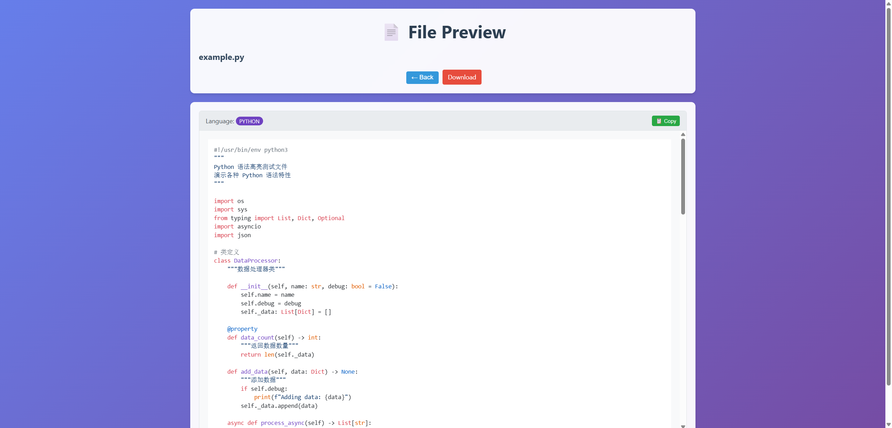
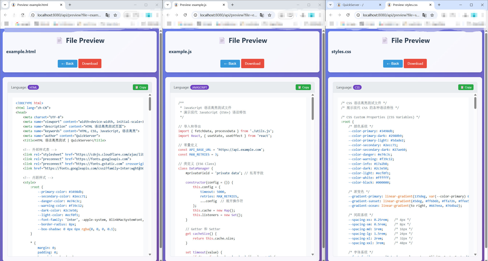
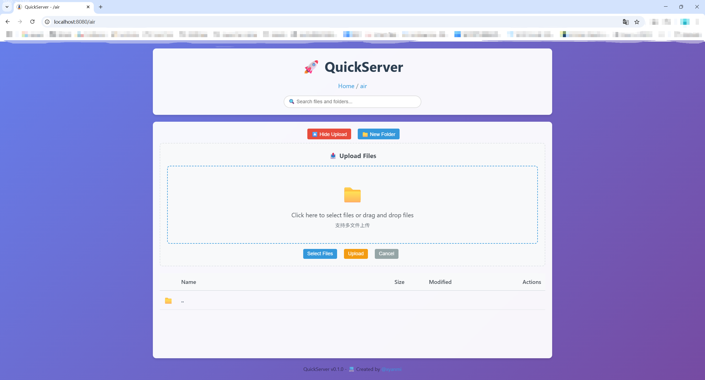

# 🚀 QuickServer

[English](#english) | [中文](#中文)

---

## 中文

QuickServer 是一个基于 Python 开发的轻量级本地文件服务器，提供了比标准 http.server 更友好、功能更丰富的 Web 界面。

### 🖼️ 界面预览

#### 主页面 - 文件浏览


现代化的文件浏览界面，支持：
- 🎨 美观的渐变背景设计
- 📁 直观的文件和文件夹图标
- 🔍 实时搜索功能
- 📱 响应式设计，支持移动设备

#### 文件预览功能


强大的文件预览能力：
- 👁️ 图片文件实时预览
- 📄 文本文件语法高亮显示
- 📋 一键复制代码内容
- ⬅️ 便捷的返回导航

#### 多语言语法高亮


支持 20+ 种编程语言的语法高亮：
- 🐍 Python, JavaScript, TypeScript
- 🌐 HTML, CSS, XML, JSON
- ⚙️ C/C++, Java, Go, Rust
- 📝 Markdown, YAML, Shell 脚本等

#### 拖拽上传功能


便捷的文件上传体验：
- 📤 拖拽文件直接上传
- 📁 支持多文件同时上传
- 📊 实时显示文件列表和大小
- ✅ 上传进度和结果反馈

### ✨ 主要特性

- 🌐 **美观的 Web 界面** - 现代化的响应式设计，支持桌面和移动设备
- 📁 **文件浏览与导航** - 直观的目录结构浏览，支持面包屑导航和实时搜索
- 👁️ **强大的文件预览** - 支持图片预览和 20+ 种编程语言的语法高亮
- ⬇️ **文件下载** - 一键下载任意文件，支持中文文件名和文件夹 ZIP 下载
- 📤 **拖拽上传** - 支持拖拽上传和多文件选择，带有进度显示
- 🗑️ **文件管理** - 文件删除、重命名、移动等完整的文件操作功能
- 📁 **文件夹操作** - 创建新文件夹、文件夹 ZIP 下载
- 🔒 **安全防护** - 防止目录遍历攻击，限制访问范围
- 📱 **响应式设计** - 在各种屏幕尺寸下都有良好的用户体验
- 🚀 **零依赖** - 仅使用 Python 标准库，无需安装额外依赖

### 🛠️ 安装与使用

#### 快速开始

```bash
# 克隆项目
git clone https://github.com/xyanmi/quickserver.git

cd quickserver
# or
python setup.py

# 启动服务器
python -m quickserver

# 或指定端口和目录
python -m quickserver -p 8080 -d /path/to/directory
```

#### 命令行选项

```bash
python -m quickserver [选项]

选项:
  -p, --port PORT        指定服务器端口 (默认: 8000)
  -d, --directory DIR    指定服务目录 (默认: 当前目录)
  --host HOST           指定绑定地址 (默认: 0.0.0.0)
  -h, --help            显示帮助信息
```

### 🌟 功能演示

访问 `http://localhost:8000` 即可使用所有功能：

- **文件浏览**: 点击文件夹进入子目录，支持面包屑导航
- **实时搜索**: 在搜索框中输入关键词快速定位文件
- **文件预览**: 点击 👁️ 图标预览支持的文件类型
- **文件下载**: 点击 ⬇️ 图标下载文件，支持文件夹 ZIP 下载
- **文件上传**: 点击"📤 Upload Files"展开上传区域，支持拖拽上传
- **文件管理**: 重命名 🏷️、删除 🗑️、移动文件到其他目录
- **新建文件夹**: 点击"📁 New Folder"创建新目录
- **打包下载**: 点击📦即可将对应文件夹打包成zip并且下载

### 🎨 支持的文件类型

#### 语法高亮预览
- **编程语言**: Python, JavaScript, TypeScript, Java, C/C++, Go, Rust, PHP
- **Web 技术**: HTML, CSS, XML, JSON, SVG
- **配置文件**: YAML, TOML, INI, ENV
- **脚本语言**: Shell, PowerShell, Batch
- **文档格式**: Markdown, LaTeX, RTF
- **数据格式**: CSV, SQL, Log 文件

#### 图片预览
- **常见格式**: JPG, PNG, GIF, SVG, WebP
- **即时预览**: 无需下载，直接在浏览器中查看

### 📋 系统要求

- Python 3.6 或更高版本
- 仅使用 Python 标准库，无需安装额外依赖
- 支持 Windows, macOS, Linux

---

⭐ If you find this project useful, please give it a star!

💡 QuickServer - Making local file serving simple and beautiful!

## English

QuickServer is a lightweight local file server developed in Python, providing a more user-friendly and feature-rich web interface than the standard http.server.

### 🖼️ Interface Preview

#### Homepage - File Browsing


Modern file browsing interface featuring:
- 🎨 Beautiful gradient background design
- 📁 Intuitive file and folder icons
- 🔍 Real-time search functionality
- 📱 Responsive design with mobile support

#### File Preview Feature


Powerful file preview capabilities:
- 👁️ Real-time image file preview
- 📄 Text file syntax highlighting
- 📋 One-click code copying
- ⬅️ Convenient back navigation

#### Multi-language Syntax Highlighting


Supports 20+ programming languages with syntax highlighting:
- 🐍 Python, JavaScript, TypeScript
- 🌐 HTML, CSS, XML, JSON
- ⚙️ C/C++, Java, Go, Rust
- 📝 Markdown, YAML, Shell scripts, etc.

#### Drag & Drop Upload


Convenient file upload experience:
- 📤 Direct drag & drop file upload
- 📁 Multi-file upload support
- 📊 Real-time file list and size display
- ✅ Upload progress and result feedback

### ✨ Key Features

- 🌐 **Beautiful Web Interface** - Modern responsive design supporting desktop and mobile devices
- 📁 **File Browsing & Navigation** - Intuitive directory structure browsing with breadcrumb navigation and real-time search
- 👁️ **Powerful File Preview** - Image preview and syntax highlighting for 20+ programming languages
- ⬇️ **File Download** - One-click download for any file, supports Chinese filenames and folder ZIP download
- 📤 **Drag & Drop Upload** - Drag & drop upload with multi-file selection and progress display
- 🗑️ **File Management** - Complete file operations including delete, rename, and move
- 📁 **Folder Operations** - Create new folders, folder ZIP download
- 🔒 **Security Protection** - Prevents directory traversal attacks, restricts access scope
- 📱 **Responsive Design** - Excellent user experience across all screen sizes
- 🚀 **Zero Dependencies** - Uses only Python standard library, no additional dependencies required

### 🛠️ Installation & Usage

#### Quick Start

```bash
# Clone the project
git clone https://github.com/xyanmi/quickserver.git

cd quickserver 
# or
python setup.py

# Start the server
python -m quickserver

# Or specify port and directory
python -m quickserver -p 8080 -d /path/to/directory
```

#### Command Line Options

```bash
python -m quickserver [options]

Options:
  -p, --port PORT        Specify server port (default: 8000)
  -d, --directory DIR    Specify serving directory (default: current directory)
  --host HOST           Specify bind address (default: 0.0.0.0)
  -h, --help            Show help message
```

### 🌟 Feature Demo

Visit `http://localhost:8000` to use all features:

- **File Browsing**: Click folders to enter subdirectories with breadcrumb navigation
- **Real-time Search**: Enter keywords in search box to quickly locate files
- **File Preview**: Click 👁️ icon to preview supported file types
- **File Download**: Click ⬇️ icon to download files, supports folder ZIP download
- **File Upload**: Click "📤 Upload Files" to expand upload area with drag & drop support
- **File Management**: Rename 🏷️, delete 🗑️, move files to other directories
- **Create Folder**: Click "📁 New Folder" to create new directories
- **Batch Download**: Click 📦 to package and download folders as ZIP files

### 🎨 Supported File Types

#### Syntax Highlighting Preview
- **Programming Languages**: Python, JavaScript, TypeScript, Java, C/C++, Go, Rust, PHP
- **Web Technologies**: HTML, CSS, XML, JSON, SVG
- **Configuration Files**: YAML, TOML, INI, ENV
- **Scripting Languages**: Shell, PowerShell, Batch
- **Document Formats**: Markdown, LaTeX, RTF
- **Data Formats**: CSV, SQL, Log files

#### Image Preview
- **Common Formats**: JPG, PNG, GIF, SVG, WebP
- **Instant Preview**: View directly in browser without downloading

### 📋 System Requirements

- Python 3.6 or higher
- Uses only Python standard library, no additional dependencies required
- Supports Windows, macOS, Linux

---

⭐ If you find this project useful, please give it a star!

💡 QuickServer - Making local file serving simple and beautiful! 